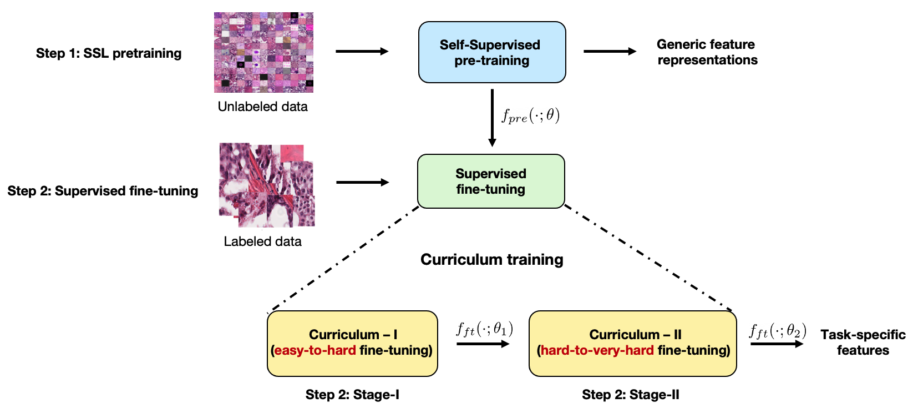
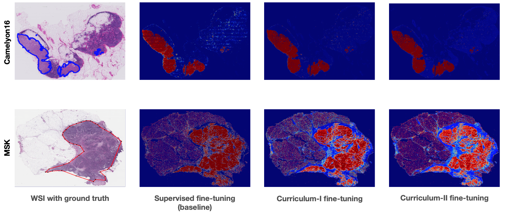

#  Improving Self-Supervised Learning with Hardness-aware Dynamic Curriculum Learning: An Application to Digital Pathology
#### by [Chetan L. Srinidhi](https://srinidhipy.github.io) and [Anne L. Martel](https://medbio.utoronto.ca/faculty/martel)

* Official repository for [Improving Self-supervised Learning with Hardness-aware Dynamic Curriculum Learning: An Application to Digital Pathology](https://arxiv.org/abs/2108.07183). **ICCV, 2021, CDpath workshop**, October, 2021. [[Conference proceedings]](https://openaccess.thecvf.com/content/ICCV2021W/CDPath/html/Srinidhi_Improving_Self-Supervised_Learning_With_Hardness-Aware_Dynamic_Curriculum_Learning_An_Application_ICCVW_2021_paper.html) [[arXiv preprint]](https://arxiv.org/abs/2108.07183)

* <a href="https://github.com/srinidhiPY/ICCV-CDPATH2021-ID-8/tree/main/models">.svg"/></a>

## Overview
In this work, we attempt to **improve self-supervised pretrained representations** through the lens of **curriculum learning** by proposing a **hardness-aware dynamic curriculum learning (HaDCL)** approach. To improve the robustness and generalizability of SSL, we dynamically leverage progressive harder examples via **easy-to-hard** and **hard-to-very-hard samples** during mini-batch downstream fine-tuning. We discover that by progressive stage-wise curriculum learning, the pretrained representations are significantly enhanced and adaptable to both **in-domain and out-of-domain** distribution data.

We carry out extensive validation experiments on **three** histopathology benchmark datasets on both **patch-wise** and **slide-level** classification tasks: 
- [Camelyon 16](https://camelyon16.grand-challenge.org)
- [Memorial Sloan Kettering Cancer Center (MSKCC), Breast Metastases dataset](https://wiki.cancerimagingarchive.net/pages/viewpage.action?pageId=52763339)
- [Colorectal Polyps classification](https://bmirds.github.io/MHIST/) 

## Method


## Results
* Predicted tumor probability heat-maps on **Camelyon16 (in-domain)** and **MSKCC (out-of-domain)** test sets


## Pre-requisites
Core implementation:
* Python 3.7+
* Pytorch 1.7+
* Openslide-python 1.1+
* Albumentations 1.8+
* Scikit-image 0.15+
* Scikit-learn 0.22+
* Matplotlib 3.2+
* Scipy, Numpy (any version)

## Datasets
* **Camelyon16**: to download the dataset, check this link :<br/>https://camelyon16.grand-challenge.org
* **MSKCC**: to download the dataset, check this link :<br/>https://wiki.cancerimagingarchive.net/pages/viewpage.action?pageId=52763339
* **MHIST**: to download the dataset, check this link :<br/>https://bmirds.github.io/MHIST/


## Training
The model training consists of **three** steps:
1. ***Self-supervised pretraining*** (i.e., Our earlier proposed method ***`Resolution sequence prediction (RSP)`*** and Momentum Contrast (MoCo))
2. ***Curriculum-I fine-tuning*** (`easy-to-hard`)
3. ***Curriculum-II fine-tuning*** (`hard-to-very-hard`)

### 1. Self-supervised pretraining
In this work, we build our approach on our previous work ["Self-Supervised driven Consistency Training for Annotation Efficient Histopathology Image Analysis](https://arxiv.org/abs/2102.03897). Please, refer to our previous [repository](https://github.com/srinidhiPY/SSL_CR_Histo) for pretraining details on whole-slide-images. We have included the pretrained model (cam_SSL_pretrained_model.pt) for Camelyon16, found in the "models" folder.

### 2, 3. Fine-tuing of pretrained models on the target task using hardness-aware dynamic curriculum learning
1. Download the self-supervised pretrained model from the models folder.
2. Download the desired dataset; you can simply add any other dataset that you wish.
3. For slide-level classification tasks, run the following command by the desired parameters. The arguments can be set in the corresponding files.
```python
python ft_Cam_SSL.py  // Supervised fine-tuning on Camelyon16    
python ft_Cam_SSL_CL_I.py    // Curriculum-I fine-tuning on Camelyon16
python ft_Cam_SSL_CL_II.py    // Curriculum-II fine-tuning on Camelyon16
```
We have included the fine-tuned models (cam_curriculum_I_finetuned_model.pt, cam_curriculum_II_finetuned_model.pt) for Camelyon16, found in the "models" folder. These models can be used to test the predictions on Camelyon16 and MSKCC test sets.

4. For patch-level classification tasks, run the following command by the desired parameters. The arguments can be set in the corresponding files.
```python
python ft_MHSIT_SSL.py  // Supervised fine-tuning on MHIST    
python ft_MHSIT_SSL_CL_I.py    // Curriculum-I fine-tuning on MHIST
python ft_MHSIT_SSL_CL_II.py    // Curriculum-II fine-tuning on MHIST
```

## Testing
The test performance is validated at **two** stages:

1. **Patch-level predictions:**
The patch-level predictions can be performed to generate tumor probability heat-maps on Camelon16 and MSKCC datasets. Note: MSKCC doesn't contain any training images and hence, we use this dataset as an external validation set to test our method's performance on out-of-distribution data.
```python
prob_map_generation.py  // tumor probability heat-map on Camelyon16, MSKCC 
eval_MHIST.py  // patch-wise predictions on MHIST 
```
2. **Random-forest-based slide-level classifier:**
The final slide-level predictions can be performed using scripts inside the "**Slide_Level_Analysis**" folder.
```python
extract_feature_heatmap.py  // to extract geometrical features from the heatmap predictions of the previous stage   
wsi_classification.py  // Random-forest based slide-level classifier
```
## License

Our code is released under [MIT license](LICENSE).

### Citation

If you find our work useful in your research or if you use parts of this code please consider citing our papers:
```
@article{srinidhi2021improving,
  title={Improving Self-supervised Learning with Hardness-aware Dynamic Curriculum Learning: An Application to Digital Pathology},
  author={Srinidhi, Chetan L and Martel, Anne L},
  journal={arXiv preprint arXiv:2108.07183},
  year={2021}
}
@article{srinidhi2021self,
  title={Self-supervised driven consistency training for annotation efficient histopathology image analysis},
  author={Srinidhi, Chetan L and Kim, Seung Wook and Chen, Fu-Der and Martel, Anne L},
  journal={arXiv preprint arXiv:2102.03897},
  year={2021}
}
```

### Acknowledgements
This work was funded by Canadian Cancer Society and Canadian Institutes of Health Research (CIHR). It was also enabled in part by support provided by Compute Canada (www.computecanada.ca).

### Questions or Comments
Please direct any questions or comments to me; I am happy to help in any way I can. You can email me directly at chetan.srinidhi@utoronto.ca.

